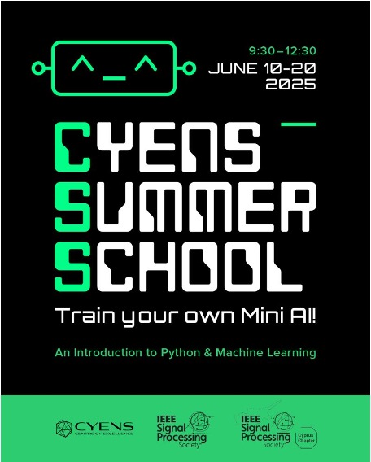

# AIML
This is an education repository that aims to teach AI and Machine Learning using images.

The website provides Google Colab notebooks used in a workshop focused on teaching middle-school and high-school students to program AI models using Python. The website provides material for two major projects. The first project involved the creation of a digital color video using hexadecimal (see Session 8 below). The second project was to train multiple AI models (see Session 16 below).  

The workshop was co-sponsored by CYENS, the IEEE Signal Processing Society, and the Cyprus Section of the IEEE Signal Processing Society. 

To run the tutorials, you will need a free Gmail account. To run the tutorials, you will only need to click on the links below. If you need a video introduction on how to run Google Colab notebooks, you can use 
[Google Colab tutorial](https://www.youtube.com/watch?v=RLYoEyIHL6A). 

If you use material from this website, please cite using: 

APA style: 
<tt>Marios S Pattichis. (2025). pattichis/AIML: An introduction to AI and Machine Learning for middle-school and high-school students (v1.0.0). Zenodo. https://doi.org/10.5281/zenodo.16888480</tt>

IEEE style: 
<tt>Marios S Pattichis, “pattichis/AIML: An introduction to AI and Machine Learning for middle-school and high-school students”. Zenodo, Aug. 17, 2025. doi: 10.5281/zenodo.16888480.</tt>

If you prefer to cite the workshop itself, you can use: 
<tt>Pattichis, M.S. (2025). Train your own Mini AI!, Summer School, CYENS. Nicosia, Cyprus.
https://github.com/pattichis/AIML.</tt> 

## Sessions

### Session 1. An Introduction
1. [Session 1.1 Introduction to Variables and Strings](Session_1_1_Intro_Variables_Strings_Modules.ipynb)
2. [Session 1.2 Working with AI](Session_1_2_Working_with_AI.ipynb)
3. [Session 1.3 An adversarial attack example of where we are going](Session_1_3_fgsm_tutorial.ipynb)
4. [Session 1.4 A video inference mode example of where we are going](Session_1_4_video_inference_mode.ipynb)

### Session 2. Number Guessing Game 
1. [Session 2. Number Guessing Game](Session_2_Number_Guessing_Game.ipynb)

### Session 3. Loops, conditionals, and sequential thinking 
1. [Session 3.1 Loops, conditionals, and sequential thinking](Session_3_1_Loops_conditionals_sequential_thinking.ipynb)
2. [Session 3.2 Escape the Maze Game](Session_3_2_Escape_the_Maze_Game.ipynb)

### Session 4. Binary numbers and hexadecimals
1. [Session 4.1 Binary numbers and hexadecimals](Session_4_binary_and_hexadecimals.ipynb)

### Session 5. Lists and black and white images
1. [Session 5.1 Lists and black and white images](Session_5_1_Lists_and_black_and_white_images.ipynb)

### Session 6. Color images
1. [Session 6.1 Color images](Session_6_1_color_images.ipynb)

### Session 7. NumPy arrays and color image analysis
1. [Session 7.1 NumPy Arrays](Session_7_1_NumPy_Arrays.ipynb)
2. [Session 7.2 Color image Analysis](Session_7_2_image_analysis_with_color.ipynb)

### Session 8. Video creation project
1. [Session 8.1 Create videos](Session_8_Create_videos.ipynb)
2. [Session 8.2 Video template](Session_8_Video_template.ipynb)

### Session 9. Dictionaries, functions, and object-oriented programming (OOP)
1. [Session 9.1 Dictionaries](Session_9_1_dictionaries.ipynb)
2. [Session 9.2 Functions](Session_9_2_functions.ipynb)
3. [Session 9.3 Object-oriented programming with classes.ipynb](Session_9_3_oop_with_classes.ipynb)

### Session 10. An introduction to neural networks, K-NN, classifiers, and clustering algorithms
1. [Session 10.1 Introduction to neural networks](Session_10_1_NN_intro.ipynb)
2. [Session 10.2 MNIST and K-nearest neighbor](Session_10_2_MNIST_and_K_NN.ipynb)
3. [Session 10.3 K-means](Session_10_3_Kmeans.ipynb)
4. [Session 10.4 Classifiers comparisons (from Scikit Learn)](Session_10_4_Classifiers_Comparisons.ipynb)
5. [Session 10.5 Clusterings comparisons (from Scikit Learn)](Session_10_5_Clusterings_Comparisons.ipynb)

### Session 11. An introduction to convolution using tensors
1. [Session 11. An introduction to convolution using tensors](Session_11_tensors_and_convolution.ipynb)

### Session 12. The linear layer
1. [Session 12. The linear layer](Session_12_Linear_Layer.ipynb)

### Session 13. Max pooling
1. [Session 13. Max pooling](Session_13_Max_Pooling.ipynb)

### Session 14. Activation functions
1. [Session 14. Activation functions](Session_14_Activation_Functions.ipynb)

### Session 15. Loss functions
1. [Session 15. Loss functions](Session_15_Loss_functions.ipynb)

### Session 16. Models
1. [Session 16 Models](Session_16_models.ipynb)
